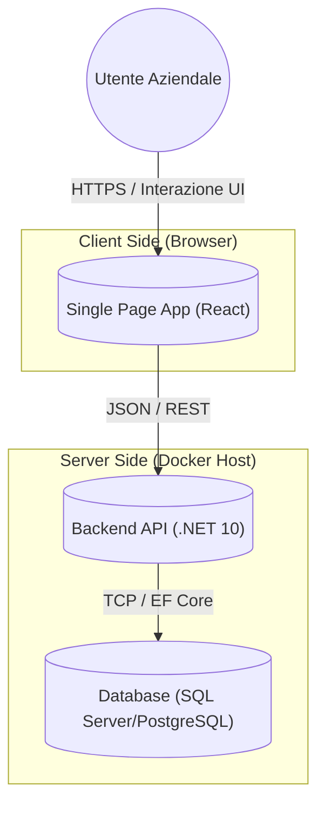

# 🏛 Architecture Overview

Questo documento fornisce una visione d'insieme dell'architettura di sistema di **Goleador**.
L'obiettivo è spiegare come i vari componenti interagiscono e come sono strutturati internamente.

## 1. High Level Design (C4 Container Diagram)

Il sistema segue un'architettura **Client-Server** classica, ospitata in un contesto **Monorepo**.

### Componenti
1.  **Frontend (SPA):** Applicazione React che gira nel browser dell'utente. Si occupa della presentazione e della logica di visualizzazione. Non comunica mai direttamente col Database.
2.  **Backend (API):** Servizio RESTful in .NET 10. È l'unica fonte di verità. Valida i dati, applica la logica di business e protegge l'accesso al Database.
3.  **Database:** Store relazionale persistente. Accessibile solo dal Backend.

---

## 2. Backend Architecture (Clean Architecture)

Il backend è organizzato secondo i principi della **Clean Architecture** (o Onion Architecture).
La regola fondamentale è la **Dependency Rule**: le dipendenze puntano solo verso l'interno. Il cerchio più interno non sa nulla di quelli esterni.

### Struttura a Strati (Layers)

#### 🟢 1. Core / Domain (`MyProject.Domain`)
È il centro del sistema. Contiene la logica di business pura e le entità aziendali.
- **Contenuto:** Entità (`Player`, `Match`), Value Objects, Eccezioni di dominio, Enums.
- **Dipendenze:** Nessuna.

#### 🟡 2. Application (`MyProject.Application`)
Definisce *cosa* il sistema può fare (Casi d'uso). Coordina il flusso dei dati dal mondo esterno al Dominio.
- **Contenuto:** Interfacce (es. `IPlayerRepository`), DTOs, Mapping, Logica CQRS (Commands/Queries), Validatori.
- **Dipendenze:** `Domain`.

#### 🔴 3. Infrastructure (`MyProject.Infrastructure`)
Implementa le interfacce definite nell'Application. Qui risiedono i dettagli tecnici.
- **Contenuto:** Implementazione EF Core (`DbContext`), Migrations, Client per servizi esterni (es. Email), File System access.
- **Dipendenze:** `Application`, `Domain`.

#### 🔵 4. Presentation / API (`MyProject.Api`)
Il punto di ingresso dell'applicazione.
- **Contenuto:** Controllers, Configurazione DI (Dependency Injection), Middleware (Logging, Error Handling).
- **Dipendenze:** `Application`, `Infrastructure`.

---

## 3. Frontend Architecture

Il frontend React è strutturato per funzionalità ("Feature-based") per garantire scalabilità.

### Flusso dei Dati tipico

1.  **User Action:** L'utente clicca "Salva Partita".
2.  **Component UI:** Il componente raccoglie i dati dal form (gestito da `react-hook-form`).
3.  **Custom Hook (TanStack Query):** Il componente chiama una mutation (es. `useCreateMatch`).
4.  **API Client:** Axios intercetta la richiesta, aggiunge eventuali token e la invia al server.
5.  **State Update:** Alla risposta positiva del server, TanStack Query invalida la cache (es. "lista partite") e la UI si aggiorna automaticamente senza ricaricare la pagina.

---

## 4. Cross-Cutting Concerns

Aspetti trasversali gestiti centralmente:

- **Validation:**
    - Frontend: Immediata (UX) tramite `Zod`.
    - Backend: Definitiva (Security) tramite `FluentValidation` nel layer Application/API.
- **Error Handling:**
    - Il backend restituisce sempre `ProblemDetails` (RFC 7807).
    - Il frontend ha intercettori Axios globali per gestire errori comuni (es. 401 logout, 500 toast di errore).
- **Configuration:**
    - Backend: `appsettings.json` e Variabili d'Ambiente.
    - Frontend: `.env` file (iniettati a build time da Vite).
