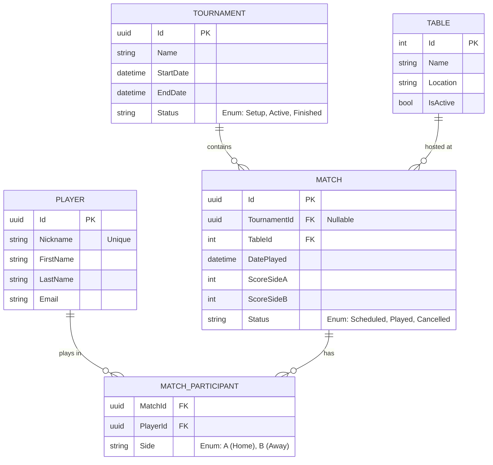

# 🗄️ Database Schema

Questo documento descrive lo schema logico del database di **Goleador**.
L'implementazione fisica sarà gestita tramite **Entity Framework Core** (Code-First), quindi le definizioni qui sotto rappresentano le Entità di dominio e le loro relazioni.

## 📊 ER Diagram (Mermaid)

## 📝 Definizione Entità

### 1. Player (Giocatori)
Rappresenta i colleghi registrati alla piattaforma.

| Campo | Tipo | Note |
| :--- | :--- | :--- |
| **Id** | `Guid` | Primary Key. |
| **Nickname** | `string(50)` | **Unique Index**. Il nome di battaglia (es. "Il Bomber"). |
| **FirstName** | `string(100)` | Nome reale. |
| **LastName** | `string(100)` | Cognome reale. |
| **Email** | `string(255)` | Per notifiche o login. |
| **CreatedAt** | `DateTime` | Data di iscrizione. |

### 2. Table (Tavoli)
I biliardini fisici presenti in azienda.

| Campo | Tipo | Note |
| :--- | :--- | :--- |
| **Id** | `int` | Primary Key (Intero incrementale va bene qui). |
| **Name** | `string(50)` | Es. "Biliardino Rosso", "Sala Relax 1". |
| **Location** | `string(100)` | Es. "Piano Terra", "Mensa". |
| **IsActive** | `bool` | Se il tavolo è rotto o rimosso, si mette a false. |

### 3. Tournament (Tornei)
Raggruppatore logico per competizioni strutturate.

| Campo | Tipo | Note |
| :--- | :--- | :--- |
| **Id** | `Guid` | Primary Key. |
| **Name** | `string(100)` | Es. "Torneo Invernale 2026". |
| **Status** | `Enum` | `0: Setup` (Iscrizioni), `1: Active`, `2: Finished`. |
| **Mode** | `Enum` | `0: RoundRobin` (Girone), `1: Elimination` (Coppa). |
| **StartDate** | `DateTime` | |
| **EndDate** | `DateTime?` | Nullable, popolato alla fine. |

### 4. Match (Partite)
L'entità centrale. Può essere un'amichevole (TournamentId = null) o una gara ufficiale.

| Campo | Tipo | Note |
| :--- | :--- | :--- |
| **Id** | `Guid` | Primary Key. |
| **TournamentId** | `Guid?` | Foreign Key (Nullable). Null se amichevole. |
| **TableId** | `int` | Foreign Key su `Table`. |
| **DatePlayed** | `DateTime` | Data e ora della partita. |
| **Status** | `Enum` | `0: Scheduled`, `1: Played`, `2: Cancelled`. |
| **ScoreSideA** | `int` | Punteggio Squadra A. |
| **ScoreSideB** | `int` | Punteggio Squadra B. |

> **Nota:** La vittoria viene calcolata a runtime confrontando `ScoreSideA` e `ScoreSideB`.

### 5. MatchParticipant (Tabella di Join)
Collega i giocatori alla partita, assegnandoli a una squadra (Lato A o Lato B).
Questo permette di gestire partite 1vs1 (2 record totali) o 2vs2 (4 record totali).

| Campo | Tipo | Note |
| :--- | :--- | :--- |
| **MatchId** | `Guid` | Foreign Key (Composite Key insieme a PlayerId). |
| **PlayerId** | `Guid` | Foreign Key. |
| **Side** | `Enum` | `0: SideA` (Casa/Blu), `1: SideB` (Ospiti/Rosso). |
